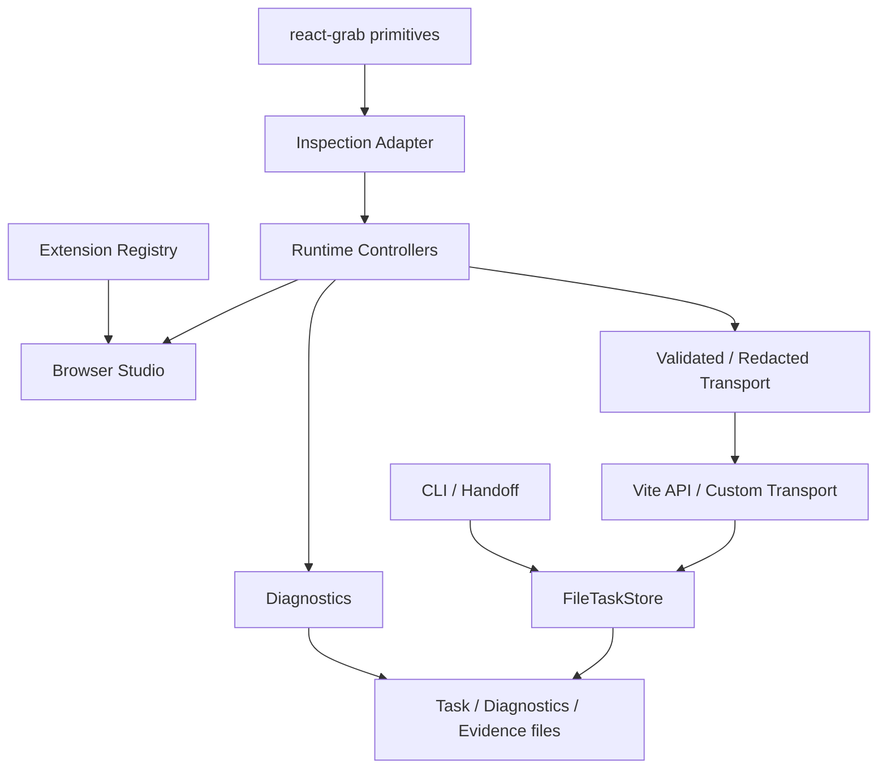
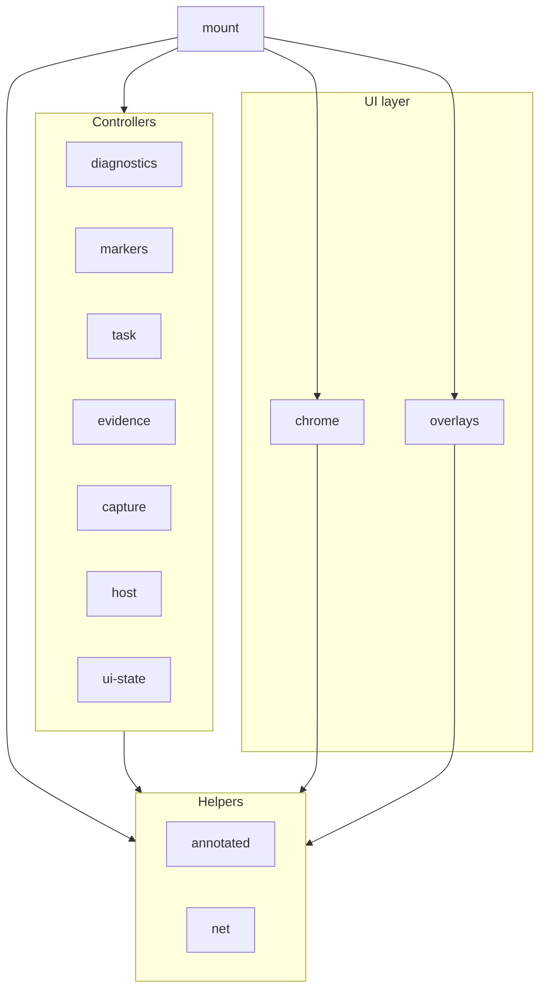

# Architecture

Release verification builds one candidate, records its SHA-256 and manifest,
and passes that same tarball to package audits and installed consumers. Repeat
browser runs reset runtime output in the existing consumer without reinstalling.

Agent Annotations is a browser annotation runtime for code review workflows: a
React/Vite-powered studio captures element, multi, and region annotations with
full observed context, persists them to a task file, and hands the task off to
a code agent that fixes the issue and completes it through the CLI.

## Dependency and data flow

- `react-grab/primitives` is imported by exactly one module
  (`src/client/inspection-engine.ts`): element inspection, selector
  generation, bounds, and grabbing stay behind that adapter.
- `Inspection Adapter` (`src/client/inspection-engine.ts`) resolves persisted
  targets (identity-validated, no fuzzy matching), samples regions, and
  exposes capture freezing.
- `Runtime Controllers` (`src/client/runtime/`) own disjoint concerns —
  task/conflict synchronization, host route/locale/theme, capture modes and
  document binding, markers and observers, evidence, diagnostics, and the
  chrome/overlays. A shared UI
  commit coordinator builds one deeply frozen public snapshot and refreshes
  Chrome once per logical state update; pointer movement only refreshes
  interactive overlays. The dependency graph is a DAG: helpers/controllers →
  chrome/overlays → mount orchestration. Only `mount.ts` may import
  `chrome`/`overlays`, and no controller may import `mount`. One stable React
  root exists in `mount.ts`; the architecture audit enforces all of this.
- `Extension Registry` (`src/extension/index.ts`) validates every
  contribution (toolbar, panels, shortcuts, host, exporters, redactors,
  enrichers, messages), rejects duplicates, and keeps the builtins in the same
  registry path as third-party extensions.
- `Validated / Redacted Transport`: every task read is schema-parsed, every
  mutation is validated and redacted (generic + extension redactors) before
  the transport sees it. `HttpTaskTransport` talks to the Vite API;
  `MemoryTaskTransport` and custom transports are supported.
- `FileTaskStore` persists the task, session, and evidence with atomic writes
  under a shared cross-process file lock with stale-lock recovery.
- Diagnostics feed the `diagnostics` boundary and handoff output; the CLI is
  the Code agent's read/write authority (`validate-task`,
  `wait --referenced-source-revision`, `complete`, `reopen`, `evidence`,
  `revision`). Source paths are canonicalized at the task mutation boundary;
  there is no separate source-normalization endpoint.

## Runtime module graph

Helpers are host-neutral pure logic; controllers exchange behavior through
narrow per-module bindings (lazy getters, no module-level mutable globals);
`mount.ts` orchestrates state, the public API, event wiring, and teardown.

## Security and privacy boundaries

- The Vite API binds to loopback by default and requires a random private
  session token.
- Diagnostics are bounded, redacted, and privacy-safe; network capture keeps
  only origin+path, never bodies/headers/auth.
- Annotation page identity comes from a safe page-context resolver: defaults
  omit queries, and host overrides are bounded and validated.
- Evidence files are confined to `<runtimeRoot>/evidence`; refs and pruning
  never follow symlinks or traverse outside.
- Task mutation payloads are redacted at the boundary before any transport.
- Mutation and evidence successes are strictly parsed, preserve task identity,
  and move revision forward; evidence also retains its target annotation.
- Third-party host callbacks are guarded under their registered extension ID;
  faults use safe defaults and one redacted structured diagnostic.
