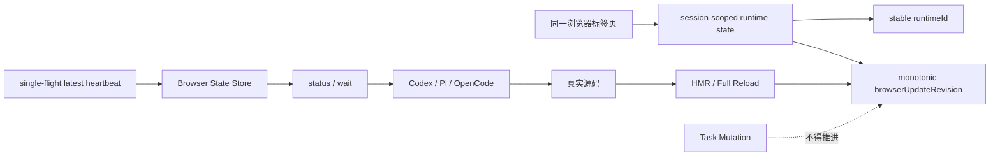

# OVERVIEW — Agent Annotations 必须修复 Goal Bundle v3

## 当前基线

```text
Repository: gchust/agent-annotations
Branch: main
Audited HEAD: 7d53c9a919caea3bbf042ffbee5901e698272d30
Package: @gchust/agent-annotations
Version: 0.1.0-alpha.0
```

每个 Goal 开始前都必须重新核验实际 HEAD、工作区和相关实现。若代码已经变化，先把新事实写入当前 Goal 的 `Surprises & Discoveries`，再在不改变产品边界的前提下适配；不得机械创建第二套实现。

## 为什么只拆成 3 个 Goal

当前架构已经基本稳定，剩余必须修复项集中在三个可独立验证的结果：

```text
Goal 01
同一浏览器标签页在 HMR 与完整 Reload 后保持 Runtime 身份，
且 browserUpdateRevision 永远单调递增。

Goal 02
Heartbeat 同一时刻最多一个请求；旧状态不能覆盖新状态。

Goal 03
用当前产品候选 SHA、同一个精确 tarball 和真实远程 CI
重新生成 Release Candidate Evidence。
```

不再拆成更多微任务，也不把 Screenshot 范围、更多 UI 功能、WebSocket、MCP、Task Schema 变更等可选事项混入本轮。

## 严格执行顺序

```text
01 → checkpoint → 02 → checkpoint → 03
```

Goal 03 必须验证 Goal 01 与 Goal 02 的最终提交，不能提前执行。

## 最终状态



## 每个 Goal 的完成规则

每个 Goal 必须满足：

1. 先检查实际仓库，不只照抄任务书。
2. 只完成当前 Goal，不提前实现后续 Goal。
3. 先运行最小相关测试，再运行 Goal 指定的完整门禁。
4. 所有 PASS 都必须附实际命令与结果；不能写“应该可以”。
5. 失败时继续修复当前范围；只有明确外部阻塞才可报告 `BLOCKED`。
6. 完成前执行独立 Review、`git diff --check`，并检查是否残留临时兼容路径。
7. 使用 Goal 指定的 Conventional Commit；不得自动发布 NPM。

## Codex 执行建议

这套文件按“一个 Goal、一个清晰停止条件”组织。复杂实现先使用 `/plan` 做当前 Goal 的仓库适配，然后再使用 `/goal` 持续执行；详细过程由 Goal 中的 `Progress`、`Surprises & Discoveries`、`Decision Log` 与 `Outcomes & Retrospective` 记录。
