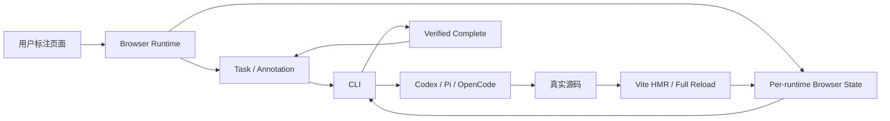

# OVERVIEW — Agent Annotations Quality Follow-up v2

## 当前基线

```text
Repository: gchust/agent-annotations
Branch: main
Audited HEAD: 6651cff4d970fd3ddf23f414d08f56149d3709ab
Package: @gchust/agent-annotations
Current version: 0.1.0-alpha.0
```

开始每个 Goal 前必须重新核验实际 HEAD。若 HEAD 已变化，先把新事实写入当前 Goal 的 `Surprises & Discoveries`，再根据共享合同适配；不得机械地创建平行实现。

## 最终产品状态



最终必须满足：

1. `browserUpdateRevision` 只由真实 Mount、Full Reload 或 `vite:afterUpdate` 推进。
2. Task Mutation 永远不能伪装成浏览器应用了源码。
3. 无 Source File 时 `referencedSourceRevision = null`，不得使用空输入 SHA。
4. CSS、主题、配置等非 React 组件文件修改可通过 Browser Update Revision 验证。
5. 默认不持久化 URL Query、凭据或未经宿主白名单处理的页面参数。
6. 多标签页各自拥有 Browser State；CLI 不做 Last Writer Wins。
7. HostIntegration 的每个第三方回调都有错误隔离和结构化 Diagnostic。
8. `mutate` / `writeEvidence` 成功返回必须满足方法级 Task ID 与 Revision 协议。
9. Marker 恢复继续坚持“精确 Selector + 身份验证”，不加入模糊 fallback。
10. Status 能验证具体 Runtime、Route、Annotation Target 与新 Diagnostics。
11. Handoff 使用跨平台 Completion Summary 文件，不把用户原始评论当作验证证据。
12. Screenshot 在 Unfreeze 前固定 DOM 状态，PNG 编码与上传继续异步。
13. 删除重复 Heartbeat、无调用 `/source` Endpoint 和重复 Snapshot 构造。
14. Release Gate 只生成一次候选 tarball，并让所有制品检查、消费者和证据复用它。
15. 当前候选获得真实 Ubuntu/Windows、Node 20/24 与 Release Job 远程 CI 结果。

## 严格执行顺序

```text
01 → 02 → 03 → 04 → 05 → 06 → 07 → 08 → 09 → 10 → 11
```

后续 Goal 可以依赖前一 Goal 的最终公开合同。不得跳过 Goal 后再通过临时兼容层补齐。

## Checkpoint 原则

每个 Goal 完成后：

1. 独立重新运行当前 Goal 的全部验收。
2. 检查 `git diff --check`。
3. 确认没有开始下一个 Goal。
4. 产生一个清晰的 Conventional Commit。
5. 再开启全新 Codex Session 执行下一个 Goal。
